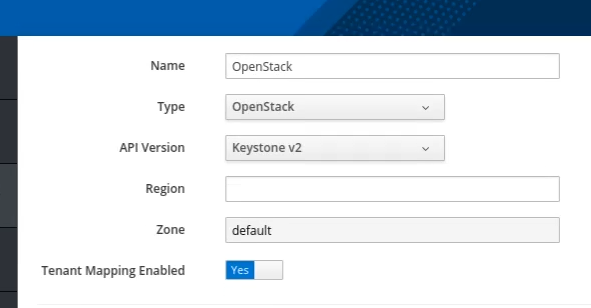

## Integration of OpenStack with ManageIQ

After the entire installation and configuration of OpenStack provider, It must be integrated with ManageIQ.

Providers are grouping of management systems. Management systems are at the center of ManageIQ's provider integration story. In ManageIQ, managers are the external management systems but later providers began managing more than one type of main resource, it became clear that providers can be broken down into separate managers.

### Add OpenStack Provider

So here we choose OpenStack for this integration as we are basically working for Infrastructure-as-a-Service.

To add a provider in ManageIQ, We need to login to ManageIQ dashboard.

Navitage to **Compute -> Clouds -> Providers** and then go to **Configuration -> Add a New Cloud Provider**. This will land you on a new screen where you need to provide information about the provider to be integrated.

Give a name to your provider and choose type as "OpenStack".

You need to add the OpenStack IP as the hostname and further fill in the username and password of OpenStack provider.

ManageIQ uses AMQP to get events, Ceilometer for metrics and Events. If you configure Ceilometer to get events then you don’t need AMQP.

Select Ceilometer as the Event.

Validate the credentials to create a cloud provider.

| Note |It takes time to integrate the cloud provider and display all its details.|
|------|:------|

Here your cloud provider is successfully integrated with ManageIQ. All the instances, images, networks, security groups, etc. are summarized here. It also displays the machine status with its last session details.

The web interface uses virtual thumbnails to represent infrastructure providers. Each thumbnail contains four quadrants by default, which display basic information about each provider:

1 Number of hosts 
2 Management system software 
3 Currently used 
4 Authentication status

You can walk through all these things by just clicking on it.

 

---

### Issue Faced

- There was a issue while validating OpenStack, but then it was because of the invalid details that was solved on later.

- The OpenStack details were not displayed after the integration of cloud provider. That was due to the choosing of Event. It was solved later with "Ceilometer" Event and yes, you need to be patient as it takes time.

---
 
