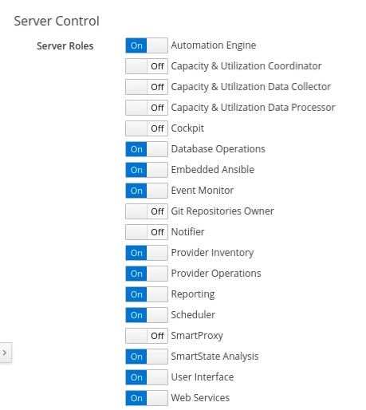

- Enabling Server Role
- rake evm:status
- evm.log and automation.log
- Add GiHub playbook Repository
- Ansible modules for OpenStack (http://docs.ansible.com/ansible/latest/list_of_cloud_modules.html#openstack)

Issue faced while enabling Embedded Ansible Server Role

# Embedded Ansible

In ManageIQ after release Fine, Ansible is embedded within it. This makes it easier to operate and work with Ansible.

After the integration of OpenStack provider with ManageIQ, It is the time to enable *EmbeddedAnsible* Server Role in Server Controls of ManageIQ. Server control defines what roles each appliance executes in a multi-appliance deployment.

For now, as we are working on Anbile, We will enable EmbeddedAnsible role.

Soo moving furthur,

- Navigate to ** Administrator|EVM -> Configuration**. This will land you on the screen of *Server Settings*.

- Enable the EmbeddedAnsible server role.

- Click the Save button to carry forward the changes.

ManageIQ will create events about EmbeddedAnsible activation.

| Note |Activation of EmbeddedAnsible Server Role will take some time upto 5 - 10 mins.|
|------|:------|

You can check the status of the task in ManageIQ by navigating to ** Administrator|EVM -> Tasks -> All Tasks tab**.
You can also check that weather the EmbeddedAnsible role has started or not by `rake evm:status`.

| Warning |If the Server Role is not started do check the `evm.log` and `automation.log` files.|
|------|:------|

