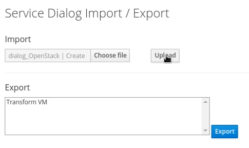
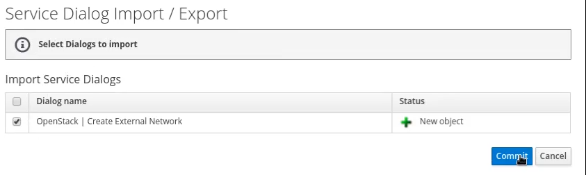
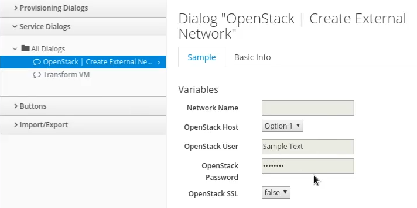
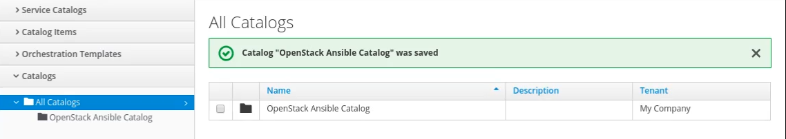
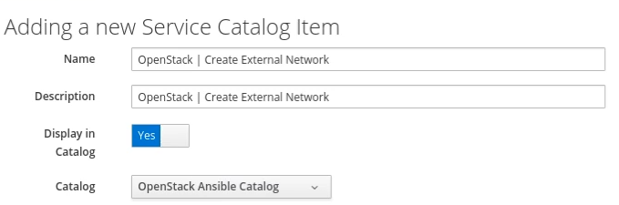
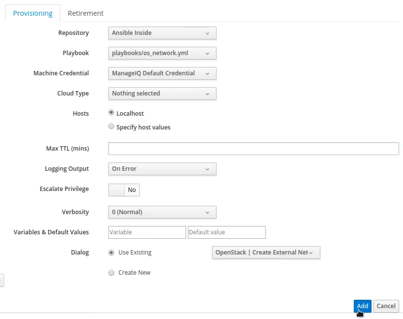

- Ansible playbook in Service Catalog item
- Use-case (Service that create External network in OpenStack)

Service Creation-
- Creating and Importing Service Dialog
- Importing and Enabling custom domain
- Creating Catalog
- Adding catalog item of type Ansible-playbook

Ordering Service
- Provision the new service
- Retire service

Problems faced
1. Script Error in Dialog
    - Need to import domin properly and enabling it. Also it should at highest priority
2. stuck Check_Provision step after ordering service.

 
## Creating a Ansible Service

Ansible is the main pillar for the automation and playbooks are its essential part. Till now we have seen the Enabling of Ansible in ManageIQ, To get the entire picture lets walk through it.

In our case we will be working on creation of a External Network. We can choose any functionality and write a playbook for it.

### Service Creation

As till now you have done with the integration and enabling of EmbeddedAnsible, now it was time for the actual working for the end user view set.

#### Creating and Importing Service Dialog

1. Moving ahead, you need to navigate from **Automation &rarr; Automate &rarr; Customization**.

2. You will land on page where you need to import the service dialog.

3. Choose the Dialog file from the playbook in the *choose file* field.

4. Import the choosen file.

5. You will get a list of service dialogs.

6. Select the dialog you wish to add from the playbook.

7. Commit the changes and go ahead.

You can view the service dialog in graphical view in the *Service Dialogs* section. You can see the list of service dialogs here and you can go through it by just on a click.

Here in our case, This service is for Creation of External Network that would collect the details from the user like Network name, OpenStack Host, Its credentials and SSL options.

#### Creating Catalog

Next, its required to create a catalog. For this

1. Navigate to **Services &rarr; Catalogs**.

2. Go to catalogs section.

3. Go through **Configurations &rarr; Add New Catalog**.

4. Give a appropriate name to the catalog.

5. Click the Add button to save the changes.

#### Adding catalog item

After the creation of catalog you need to add items to this catalog. For that,

1. Select the Catalog Items section in **Services &rarr; Catalogs **.

2. Here you can see a list of catalogs created.

3. Select a catalog you want to work on.

4. Walk through **Configuration &rarr; Add New Catalog Item**.

5. Select *Ansible playbook* as a catalog item type from the dropdown menu.

6. Add a appropriate name to the catalog item which ever you think is good.

7. Give a discription to this catalog item.

8. Enable the option of displayimg the item in catalog. By default it is disabled.

9. Select the catalog you wish to work on and have been added before as we have seen it previously.

10. Select the repo you want your catalog item to run on. We have already added this repo in [**_chapter_3_**](chapter_3/embedded_ansible.md).

11. Select the playbook you need your user to avail the facility, In our case we are working on network playbook.

12. Give proper ManageIQ Credentials from the drop down menu.

13. Select a proper Cloud Type. By default nothing is selected.

14. Host is to be selected. Localhost is the default choice.

15. Log out on error. This is by default.

16. As we have already added the dialog. We will choose Existing dialog.

17. Select the added service dialog for the catalog item.

18. Select the add button to save the changes.

This will show you the details about the catalog. You can view the brief summary of the catalog right from its creation, number of playbooks, etc on just click.
